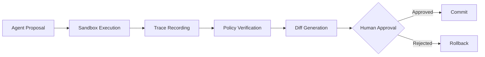

# Runtime Loop

## Principles

### Separation of concerns

Agent reasoning should be separated from state mutation.

### Reversible execution

All state transitions should be inspectable and reversible.

### Explicit approval boundaries

Human approval is a runtime primitive, not an afterthought.

### Provenance-first design

Every material action should produce a trace.

## Future extensions

- semantic diffs
- branchable memory
- WASM isolation
- multi-agent coordination
- execution attestations
